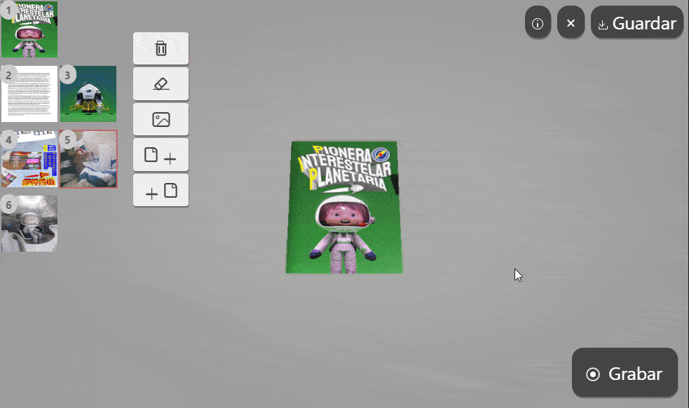

# Flipbook to video :tv:

## :rocket: [ Open Editor](https://bandinopla.github.io/flipbook-to-video/) :rocket:

Create a Flipbook and export it as a video. It uses [THREE.js](https://github.com/mrdoob/three.js) as 3D engine and [quick_flipbook](https://github.com/bandinopla/quick_flipbook) to generate the flipbook.

## Motivation
The idea is to be able to select a bunch of pre-designed pages, setup this 3D book, and capture the interaction with it into a video (you flipping the pages, etc...) and obtain a video that you can use in diferent things.

## How to use
1. **create a book**
2. **add pages** to it (selecting png files for the pages)
3. **hit "record"** and interact with the flipbook, each frame of the interaction will be recorded to a video.
4. hit **stop recording** and download the video.
5. **upload it** to some converting site to turn the .webm into a .mp4